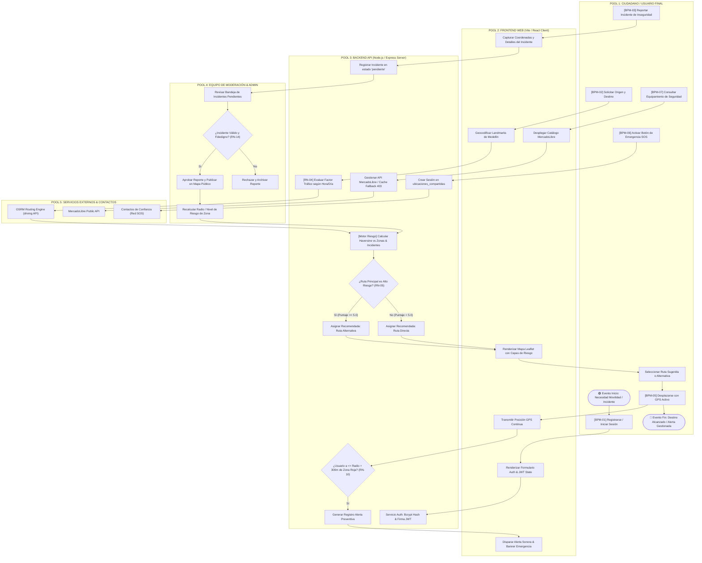
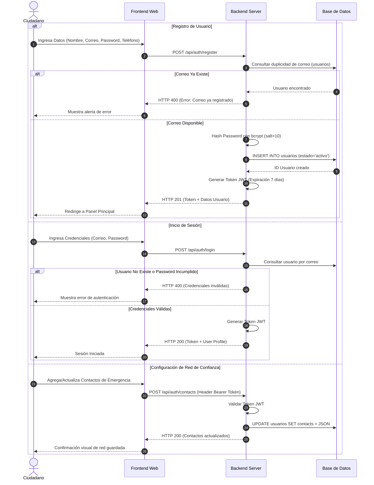
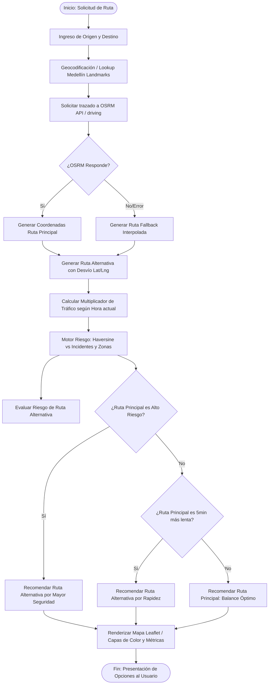
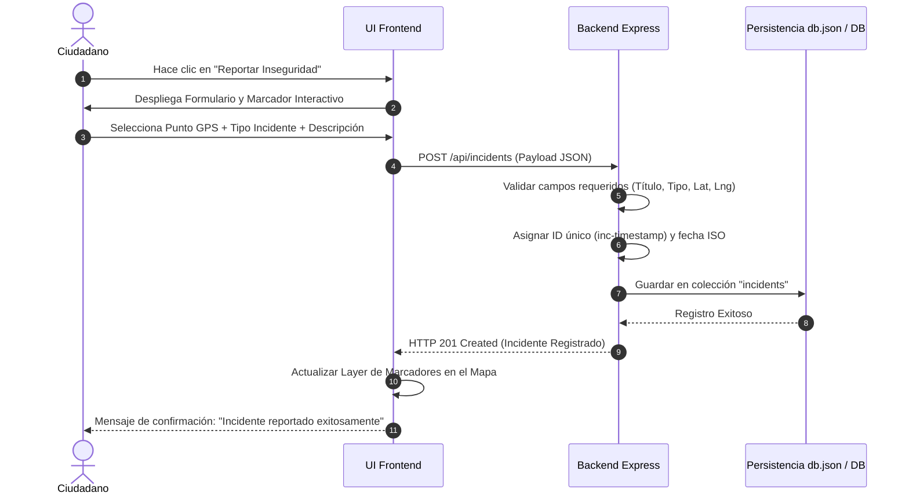
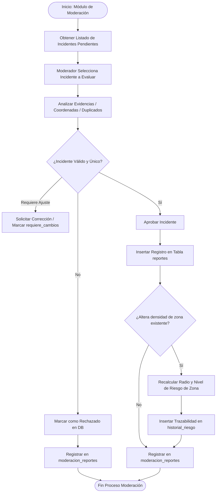
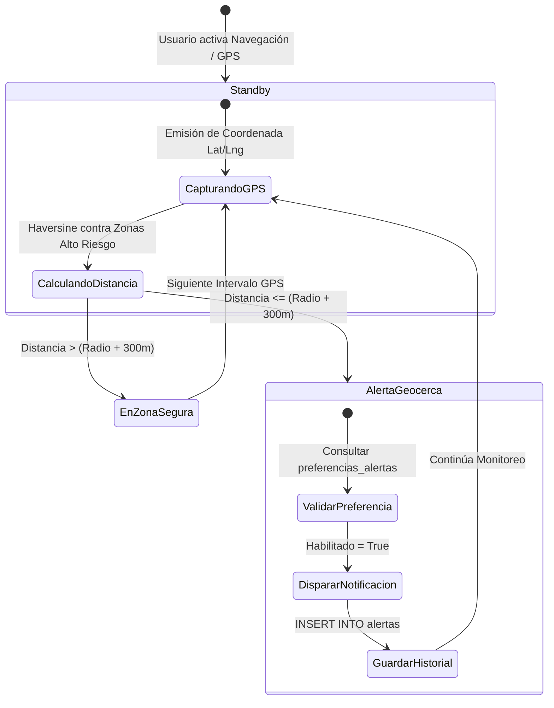
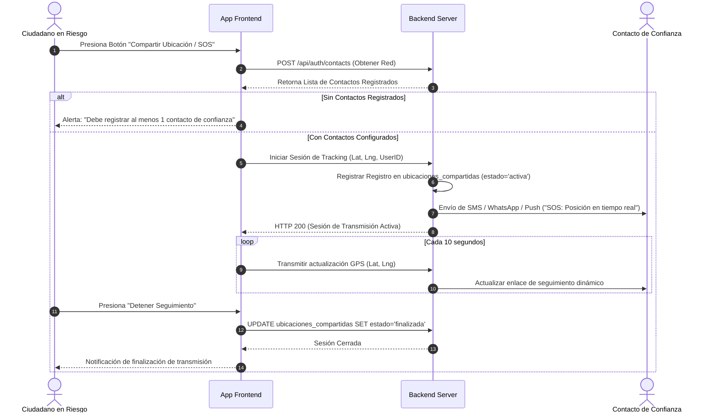
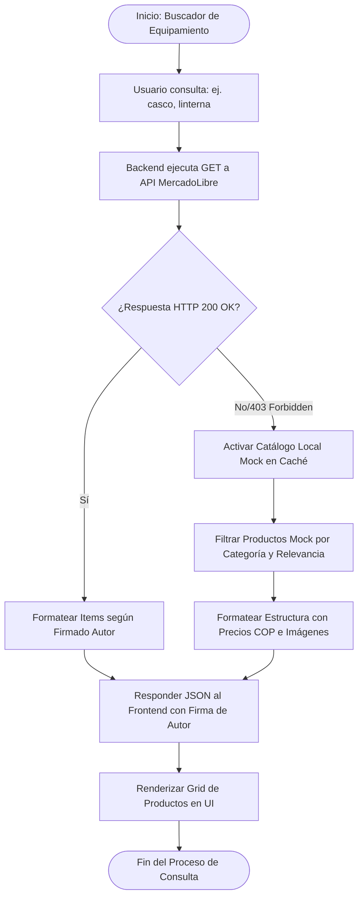

# Documentación de Modelado de Procesos de Negocio (BPM / BPMN 2.0)
## Proyecto: "Rutas Inseguras" — Plataforma de Movilidad Segura en Medellín

---

## 1. Introducción y Alcance

### 1.1 Objetivo del Documento
El presente documento tiene como objetivo formalizar y estandarizar la especificación del **Modelado de Procesos de Negocio (BPM - Business Process Management)** y sus correspondientes flujos en notación **BPMN 2.0** para la plataforma **"Rutas Inseguras"**.

Esta especificación detalla las actividades, secuencias, reglas de negocio, actores intervinientes, compuertas de decisión, intercambios de datos y puntos de integración tecnológica dentro del sistema.

### 1.2 Contexto del Proyecto
**"Rutas Inseguras"** es una solución tecnológica web/móvil orientada a la seguridad ciudadana y la movilidad inteligente en la ciudad de Medellín. Permite a los ciudadanos:
1. Consultar trayectos seguros evaluando en tiempo real el tráfico y los niveles de riesgo por criminalidad.
2. Reportar incidentes de inseguridad de forma colaborativa (crowdsourcing).
3. Recibir alertas preventivas geolocalizadas al aproximarse a zonas críticas.
4. Transmitir su ubicación GPS en tiempo real a una red de contactos de confianza ante emergencias.
5. Adquirir equipamiento de seguridad personal a través de la integración con el ecosistema de MercadoLibre.

---

## 2. Matriz de Actores y Roles (Swimlanes)

En la modelación BPMN se establecen los siguientes carriles (lanes) operacionales y tecnológicos:

| Actor / Rol | Tipo | Descripción y Atribuciones |
| :--- | :--- | :--- |
| **Ciudadano / Usuario Final** | Humano (Externo) | Usuario que consulta rutas, reporta incidentes, recibe alertas y comparte su geolocalización SOS. |
| **Moderador de Seguridad** | Humano (Interno) | Operador encargado de auditar, verificar, aprobar o rechazar los reportes ciudadanos de incidentes. |
| **Administrador del Sistema** | Humano (Interno) | Responsable de la gestión de roles, auditoría global y catalogación de zonas de riesgo. |
| **Contactos de Confianza** | Humano (Destinatario) | Red de emergencia del usuario que recibe notificaciones de seguimiento en tiempo real y alertas SOS. |
| **Frontend Web (Vite/React)** | Sistema (Cliente) | Interfaz visual interactiva con mapas, formularios y notificaciones. |
| **Backend API (Node.js/Express)** | Sistema (Servidor) | Núcleo de servicios REST, procesamiento de lógica de negocio y autenticación JWT. |
| **Motor de Evaluación de Riesgo** | Algoritmo | Componente de cálculo espacial que aplica la fórmula de Haversine y ponderaciones de peligro. |
| **Servicio OSRM Routing** | API Externa | Proveedor de cálculo geométrico y ruteo sobre red vial urbana. |
| **API MercadoLibre / Cache** | API Externa / Servicio | Proveedor de catálogo de insumos de protección y equipos de seguridad personal. |

---

## 3. Catálogo General de Procesos de Negocio

| Código BPM | Nombre del Proceso | Tipo de Proceso | Mapeo DB / Requerimiento |
| :--- | :--- | :--- | :--- |
| **BPM-01** | Gestión de Usuarios, Autenticación y Red de Confianza | Soporte / Identidad | RF-01, RF-02, RF-12 / `usuarios`, `contactos_confianza` |
| **BPM-02** | Cálculo y Recomendación de Rutas Seguras con Tráfico Dinámico | Misional / Core | RF-04, RF-05, RN-04, RN-05 / `rutas`, `alternativas_ruta` |
| **BPM-03** | Reporte Ciudadano de Incidentes de Inseguridad | Misional / Crowdsourcing | RF-08 / `incidentes` |
| **BPM-04** | Moderación, Verificación y Catalogación de Zonas de Riesgo | Control / Operativo | RF-06, RF-07, RF-14 / `moderacion_reportes`, `zonas_riesgo` |
| **BPM-05** | Monitoreo GPS y Motor de Alertas Preventivas en Tiempo Real | Misional / Prevención | RF-03, RF-10, RF-11 / `ubicaciones`, `alertas` |
| **BPM-06** | Transmisión de Ubicación de Emergencia / SOS a Contactos | Misional / Emergencia | RF-13 / `ubicaciones_compartidas` |
| **BPM-07** | Consulta e Integración con Catálogo de Seguridad MercadoLibre | Valor Agregado | Integración ML / `/api/items` |

---

## 3.5 DIAGRAMA BPMN GLOBAL DEL SISTEMA (MACROPROCESO END-TO-END CON SWIMLANES)

A continuación se representa la arquitectura global de procesos de negocio de **"Rutas Inseguras"** organizada en carriles (*Swimlanes*) para diferenciar la responsabilidad de cada actor y capa tecnológica:

---

## 4. Detalle Técnico y Diagramas BPMN por Módulo

---

### 4.1 BPM-01: Gestión de Usuarios, Autenticación y Red de Confianza

#### Descripción del Flujo
Este proceso gobierna el ciclo de vida de registro, inicio de sesión y configuración del perfil del ciudadano, incluyendo el registro de sus contactos de confianza para casos de emergencia.

#### Reglas de Negocio Aplicadas
- **RN-01**: Las contraseñas deben almacenarse bajo hash BCrypt con factor de costo 10.
- **RN-02**: Todo correo electrónico debe ser único en el sistema.
- **RN-12**: Un usuario puede registrar $N$ contactos de confianza indicando nombre, teléfono y parentesco.

---

### 4.2 BPM-02: Cálculo y Recomendación de Rutas Seguras con Tráfico Dinámico

#### Descripción del Flujo
Es el proceso central de la plataforma. Recibe una solicitud de origen y destino, geocodifica los puntos, obtiene la ruta geométrica desde OSRM, aplica multiplicadores de densidad de tráfico según el horario y evalúa el nivel de riesgo espacial en base a incidentes y zonas de peligro.

#### Reglas de Negocio Aplicadas
- **RN-04 (Evaluación de Tráfico)**:
  - Horas Pico (07:00-09:00, 12:00-13:00, 17:00-19:00): Multiplicador x1.5 (+50% tiempo).
  - Horas Hombro (06:00-10:00, 11:00-13:00, 16:00-20:00): Multiplicador x1.3 (+30% tiempo).
  - Horario Nocturno (21:00-05:00): Multiplicador x0.9 (-10% tiempo, pero alerta de riesgo elevado).
  - Horario Valle: Multiplicador x1.0.
- **RN-05 (Prioridad de Recomendación)**: Si la ruta directa atraviesa una zona de *Riesgo Alto* (Puntaje $\ge 5.0$), el sistema **recomienda obligatoriamente la Ruta Alternativa**, fundamentando el desvío por razones de seguridad.

---

### 4.3 BPM-03: Reporte Ciudadano de Incidentes de Inseguridad

#### Descripción del Flujo
Permite a cualquier usuario presenciar o notificar un evento delictivo (hurto, atraco, falta de iluminación, acoso, etc.), marcando la coordenada exacta en el mapa e ingresando los detalles del suceso.

#### Reglas de Negocio Aplicadas
- **RN-08**: El reporte requiere coordenadas válidas, categoría, descripción y emisor.
- **RN-09**: El reporte ingresa inicialmente en estado `pendiente` para revisión del moderador (o `aprobado` de forma automática en modo demostración operacional).

---

### 4.4 BPM-04: Moderación, Verificación y Catalogación de Zonas de Riesgo

#### Descripción del Flujo
Proceso de control mediante el cual un Moderador o Administrador analiza los reportes pendientes, verifica su autenticidad y los consolida en la capa pública de la plataforma o ajusta los polígonos/radios de las zonas de riesgo urbanas.

---

### 4.5 BPM-05: Monitoreo GPS y Motor de Alertas Preventivas en Tiempo Real

#### Descripción del Flujo
Servicio en segundo plano que monitorea la trayectoria GPS del usuario en movimiento. Al detectar que la distancia a una zona clasificada de *Alto Riesgo* es inferior al umbral preventivo (300 metros del borde), el sistema emite una notificación de advertencia inmediata.

#### Reglas de Negocio Aplicadas
- **RN-10 (Geocerca Preventiva)**: Distancia de activación $D \le (\text{Radio de Zona} + 300\text{m})$.
- **RN-11 (Filtro de Preferencias)**: La alerta se despliega únicamente si el usuario mantiene activado ese tipo de notificación en sus preferencias.

---

### 4.6 BPM-06: Transmisión de Ubicación de Emergencia / SOS a Contactos de Confianza

#### Descripción del Flujo
Permite activar una sesión de pánico o monitoreo continuo en tiempo real. La posición GPS del usuario se retransmite a su red de contactos de emergencia registrados en `contactos_confianza`.

---

### 4.7 BPM-07: Consulta e Integración con Catálogo de Seguridad MercadoLibre

#### Descripción del Flujo
Ofrece al usuario la posibilidad de buscar y adquirir equipamiento de protección personal (cascos homologados, linternas tácticas, chalecos reflectivos, alarmas sonoras, candados de seguridad). Implementa un patrón de **Resiliencia y Auto-Recuperación (Self-healing)** para evitar interrupciones en caso de bloqueos externos (HTTP 403 o fallas de red).

---

## 5. Matriz de Trazabilidad (BPM vs. Requerimientos e Indicadores KPIs)

### 5.1 Matriz de Alineación de Requerimientos

| Código BPM | Requerimiento Funcional | Tabla de Base de Datos Principal | Criterio de Aceptación / Verificación |
| :--- | :--- | :--- | :--- |
| **BPM-01** | RF-01, RF-02, RF-12 | `usuarios`, `contactos_confianza` | Registro exitoso, hash bcrypt verificado y gestión de contactos. |
| **BPM-02** | RF-04, RF-05, RN-04, RN-05 | `rutas`, `alternativas_ruta` | Desvío automático si ruta directa es de Alto Riesgo; cálculo de minutos con tráfico. |
| **BPM-03** | RF-08 | `incidentes` | Incidente ubicado geométricamente con tipo y descripción persistida. |
| **BPM-04** | RF-06, RF-07, RF-14 | `moderacion_reportes`, `zonas_riesgo` | Dictamen de moderación registrado y auditoría en `historial_riesgo`. |
| **BPM-05** | RF-03, RF-10, RF-11 | `ubicaciones`, `alertas` | Alerta disparada al estar a menos de (Radio + 300m) de zona roja. |
| **BPM-06** | RF-13 | `ubicaciones_compartidas` | Notificación enviada a contactos y sesión de seguimiento activa. |
| **BPM-07** | Integración ML API | Endpoint `/api/items` | Respuesta en < 500ms con fallback resiliente ante fallas 403. |

---

### 5.2 Indicadores Clave de Desempeño (KPIs del Negocio)

1. **Tiempo de Cálculo de Ruta Segura ($KPI_1$)**:
   $$\text{Tiempo Promedio} \le 1.5 \text{ segundos desde la solicitud del usuario.}$$
2. **Efectividad de Desvío Preventivo ($KPI_2$)**:
   $$\% \text{ Rutas Alternativas Adoptadas} = \left( \frac{\text{Rutas Alternativas Seleccionadas}}{\text{Total Rutas de Alto Riesgo Calculadas}} \right) \times 100 \ge 85\%$$
3. **Tiempo de Respuesta a Alertas SOS ($KPI_3$)**:
   $$\text{Despacho Notificación a Contactos} \le 3.0 \text{ segundos desde el clic en SOS.}$$
4. **Tasa de Resiliencia del Catálogo ($KPI_4$)**:
   $$\text{Disponibilidad del Servicio de Equipamiento} = 99.9\% \text{ (gracias al motor Fallback Local).}$$
