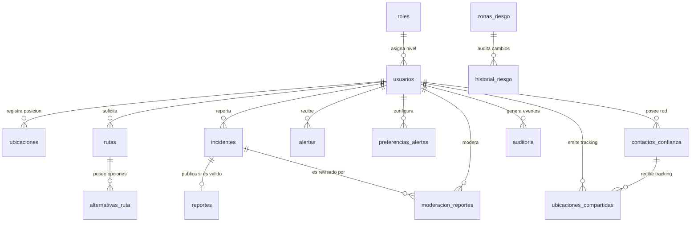

# Diccionario de Base de Datos — Proyecto "Rutas Inseguras"

**Nombre de la Base de Datos:** `rutas_inseguras_db`  
**Motor de Base de Datos:** MariaDB 10.4+ / MySQL 8.0+  
**Cotejamiento / Juego de Caracteres:** `utf8mb4_unicode_ci`  
**Nivel de Normalización:** Tercera Forma Normal (3FN)  
**Mapeo de Requerimientos:** Requisitos de Información RI-01 a RI-16 (Matriz de Requerimientos)

---

## Índice de Tablas

| Nro. | Nombre de la Tabla | Requisito de Información | Descripción Sintética |
| :--- | :--- | :--- | :--- |
| 1 | `roles` | RI-01 | Catálogo de roles y niveles de acceso al sistema |
| 2 | `usuarios` | RI-02 | Información personal y credenciales de usuarios |
| 3 | `ubicaciones` | RI-03 | Histórico de posiciones GPS en tiempo real |
| 4 | `rutas` | RI-04 | Consultas de trayectos y cálculo de riesgo |
| 5 | `alternativas_ruta` | RI-05 | Rutas secundarias sugeridas para evitar peligro |
| 6 | `zonas_riesgo` | RI-06 | Cuadrantes y radios de inseguridad catalogados |
| 7 | `historial_riesgo` | RI-07 | Trazabilidad de cambios en niveles de riesgo de zonas |
| 8 | `incidentes` | RI-08 | Reportes ciudadanos de hechos delictivos |
| 9 | `reportes` | RI-09 | Publicaciones oficiales de incidentes aprobados |
| 10 | `alertas` | RI-10 | Notificaciones preventivas emitidas a los usuarios |
| 11 | `preferencias_alertas` | RI-11 | Configuración personalizada de alertas por usuario |
| 12 | `contactos_confianza` | RI-12 | Directorio de contactos para emergencias |
| 13 | `ubicaciones_compartidas` | RI-13 | Sesiones de monitoreo en tiempo real |
| 14 | `moderacion_reportes` | RI-14 | Bitácora de aprobación/rechazo de incidentes por moderadores |
| 15 | `auditoria` | RI-15 / RNF-11 | Log de auditoría técnica y eventos del sistema |
| 16 | `estadisticas` | RI-16 | Informes analíticos y métricas agregadas de seguridad |

---

## Detalle Técnico de Tablas

### 1. Tabla: `roles` (RI-01)
Define la jerarquía de usuarios dentro del sistema.

| Nombre del Campo | Tipo de Dato | Long. / Prec. | Nulo | Clave | Valor por Defecto | Descripción / Regla de Negocio |
| :--- | :--- | :--- | :--- | :--- | :--- | :--- |
| `id_rol` | INT | Auto_Increment | NO | PK | N/A | Identificador único del rol. |
| `nombre_rol` | VARCHAR | 50 | NO | UQ | N/A | Nombre del rol (ej: Administrador, Moderador, Usuario Ciudadano). |
| `descripcion` | TEXT | N/A | SI | Ninguna | NULL | Descripción detallada de las atribuciones del rol. |
| `nivel_acceso` | INT | N/A | NO | Ninguna | 1 | Nivel de jerarquía (1=Básico, 2=Moderador, 3=Administrador). |

---

### 2. Tabla: `usuarios` (RI-02)
Almacena las cuentas de usuario registradas.

| Nombre del Campo | Tipo de Dato | Long. / Prec. | Nulo | Clave | Valor por Defecto | Descripción / Regla de Negocio |
| :--- | :--- | :--- | :--- | :--- | :--- | :--- |
| `id_usuario` | INT | Auto_Increment | NO | PK | N/A | Identificador único del usuario. |
| `nombre` | VARCHAR | 100 | NO | Ninguna | N/A | Nombre completo del usuario. |
| `correo` | VARCHAR | 150 | NO | UQ | N/A | Correo electrónico institucional o personal (login). |
| `contrasena` | VARCHAR | 255 | NO | Ninguna | N/A | Hash cifrado bcrypt de la contraseña. |
| `telefono` | VARCHAR | 20 | SI | Ninguna | NULL | Número telefónico de contacto. |
| `estado` | ENUM | 'activo','inactivo','bloqueado' | NO | Ninguna | 'activo' | Estado operativo de la cuenta de usuario. |
| `fecha_registro` | DATETIME | N/A | NO | Ninguna | CURRENT_TIMESTAMP | Fecha y hora de creación de la cuenta. |
| `id_rol` | INT | N/A | NO | FK | N/A | Rol asignado. Refers to `roles.id_rol`. |

---

### 3. Tabla: `ubicaciones` (RI-03)
Geolocalización capturada del dispositivo del usuario.

| Nombre del Campo | Tipo de Dato | Long. / Prec. | Nulo | Clave | Valor por Defecto | Descripción / Regla de Negocio |
| :--- | :--- | :--- | :--- | :--- | :--- | :--- |
| `id_ubicacion` | INT | Auto_Increment | NO | PK | N/A | Identificador de la muestra GPS. |
| `id_usuario` | INT | N/A | NO | FK | N/A | Usuario emisor. Refers to `usuarios.id_usuario`. |
| `latitud` | DECIMAL | (10,8) | NO | IX | N/A | Latitud geográfica expresada en grados decimales. |
| `longitud` | DECIMAL | (11,8) | NO | IX | N/A | Longitud geográfica expresada en grados decimales. |
| `fecha_hora` | DATETIME | N/A | NO | Ninguna | CURRENT_TIMESTAMP | Momento exacto de captura. |

---

### 4. Tabla: `rutas` (RI-04)
Almacena las solicitudes de navegación realizadas por los usuarios.

| Nombre del Campo | Tipo de Dato | Long. / Prec. | Nulo | Clave | Valor por Defecto | Descripción / Regla de Negocio |
| :--- | :--- | :--- | :--- | :--- | :--- | :--- |
| `id_ruta` | INT | Auto_Increment | NO | PK | N/A | Identificador único del cálculo de ruta. |
| `id_usuario` | INT | N/A | NO | FK | N/A | Usuario solicitante. Refers to `usuarios.id_usuario`. |
| `origen` | VARCHAR | 255 | NO | Ninguna | N/A | Dirección o coordenada de inicio. |
| `destino` | VARCHAR | 255 | NO | Ninguna | N/A | Dirección o coordenada de llegada. |
| `distancia` | DECIMAL | (8,2) | NO | Ninguna | N/A | Distancia total en kilómetros. |
| `duracion_estimada_min` | INT | N/A | NO | Ninguna | 0 | Tiempo estimado en minutos con tráfico. |
| `nivel_riesgo` | ENUM | 'Bajo','Medio','Alto' | NO | Ninguna | 'Bajo' | Nivel de riesgo global evaluado para la ruta principal. |
| `fecha_consulta` | DATETIME | N/A | NO | Ninguna | CURRENT_TIMESTAMP | Estampa de tiempo de la solicitud. |

---

### 5. Tabla: `alternativas_ruta` (RI-05)
Variantes de rutas calculadas para mitigar zonas inseguras.

| Nombre del Campo | Tipo de Dato | Long. / Prec. | Nulo | Clave | Valor por Defecto | Descripción / Regla de Negocio |
| :--- | :--- | :--- | :--- | :--- | :--- | :--- |
| `id_alternativa` | INT | Auto_Increment | NO | PK | N/A | Identificador de la opción alternativa. |
| `id_ruta` | INT | N/A | NO | FK | N/A | Ruta madre asociada. Refers to `rutas.id_ruta`. |
| `descripcion` | TEXT | N/A | NO | Ninguna | N/A | Vía o desvío recomendado (ej: Vía por Av. El Poblado). |
| `distancia_alt` | DECIMAL | (8,2) | NO | Ninguna | N/A | Distancia en kilómetros de la alternativa. |
| `duracion_min` | INT | N/A | NO | Ninguna | N/A | Tiempo estimado de recorrido. |
| `nivel_riesgo` | ENUM | 'Bajo','Medio','Alto' | NO | Ninguna | 'Bajo' | Nivel de riesgo de la ruta alternativa. |

---

### 6. Tabla: `zonas_riesgo` (RI-06)
Polígonos y puntos críticos de inseguridad en la ciudad.

| Nombre del Campo | Tipo de Dato | Long. / Prec. | Nulo | Clave | Valor por Defecto | Descripción / Regla de Negocio |
| :--- | :--- | :--- | :--- | :--- | :--- | :--- |
| `id_zona` | INT | Auto_Increment | NO | PK | N/A | Identificador único de la zona. |
| `nombre_zona` | VARCHAR | 150 | NO | Ninguna | N/A | Nombre o referencia del sector/barrio. |
| `nivel_riesgo` | ENUM | 'Bajo','Medio','Alto' | NO | Ninguna | 'Alto' | Clasificación del peligro. |
| `latitud` | DECIMAL | (10,8) | NO | IX | N/A | Latitud del centroide de la zona. |
| `longitud` | DECIMAL | (11,8) | NO | IX | N/A | Longitud del centroide de la zona. |
| `radio_metros` | INT | N/A | NO | Ninguna | 500 | Radio de cobertura del peligro en metros. |
| `coordenadas` | TEXT | N/A | SI | Ninguna | NULL | Polígono de la zona en formato JSON / WKT. |
| `fecha_creacion` | DATETIME | N/A | NO | Ninguna | CURRENT_TIMESTAMP | Registro de la zona en el catálogo. |

---

### 7. Tabla: `historial_riesgo` (RI-07)
Auditoría de cambios en los niveles de riesgo de zonas urbanas.

| Nombre del Campo | Tipo de Dato | Long. / Prec. | Nulo | Clave | Valor por Defecto | Descripción / Regla de Negocio |
| :--- | :--- | :--- | :--- | :--- | :--- | :--- |
| `id_historial` | INT | Auto_Increment | NO | PK | N/A | Identificador de la modificación. |
| `id_zona` | INT | N/A | NO | FK | N/A | Zona modificada. Refers to `zonas_riesgo.id_zona`. |
| `fecha_actualizacion` | DATETIME | N/A | NO | Ninguna | CURRENT_TIMESTAMP | Fecha del cambio de categoría. |
| `nivel_riesgo_anterior` | ENUM | 'Bajo','Medio','Alto' | SI | Ninguna | NULL | Nivel que tenía previamente. |
| `nivel_riesgo_nuevo` | ENUM | 'Bajo','Medio','Alto' | NO | Ninguna | N/A | Nuevo nivel asignado. |
| `motivo` | VARCHAR | 255 | SI | Ninguna | NULL | Justificación del cambio (ej: Incremento de reportes). |

---

### 8. Tabla: `incidentes` (RI-08)
Reportes directos de la ciudadanía sobre eventos delictivos o de peligro.

| Nombre del Campo | Tipo de Dato | Long. / Prec. | Nulo | Clave | Valor por Defecto | Descripción / Regla de Negocio |
| :--- | :--- | :--- | :--- | :--- | :--- | :--- |
| `id_incidente` | INT | Auto_Increment | NO | PK | N/A | Identificador del incidente. |
| `id_usuario` | INT | N/A | NO | FK | N/A | Usuario informante. Refers to `usuarios.id_usuario`. |
| `tipo_incidente` | VARCHAR | 100 | NO | Ninguna | N/A | Categoría del hecho (Hurto, Acoso, Atraco, etc.). |
| `descripcion` | TEXT | N/A | SI | Ninguna | NULL | Resumen detallado del evento. |
| `latitud` | DECIMAL | (10,8) | NO | IX | N/A | Coordenada latitud exacta del suceso. |
| `longitud` | DECIMAL | (11,8) | NO | IX | N/A | Coordenada longitud exacta del suceso. |
| `ubicacion` | VARCHAR | 255 | NO | Ninguna | N/A | Dirección o punto de referencia textual. |
| `fecha_reporte` | DATETIME | N/A | NO | Ninguna | CURRENT_TIMESTAMP | Timestamp en el que se emitió el reporte. |
| `estado` | ENUM | 'pendiente','aprobado','rechazado' | NO | Ninguna | 'pendiente' | Estado dentro del flujo de moderación. |

---

### 9. Tabla: `reportes` (RI-09)
Incidentes verificados y aptos para ser mostrados en el mapa público.

| Nombre del Campo | Tipo de Dato | Long. / Prec. | Nulo | Clave | Valor por Defecto | Descripción / Regla de Negocio |
| :--- | :--- | :--- | :--- | :--- | :--- | :--- |
| `id_reporte` | INT | Auto_Increment | NO | PK | N/A | Identificador único de la publicación. |
| `id_incidente` | INT | N/A | NO | FK, UQ | N/A | Incidente origen. Refers to `incidentes.id_incidente`. |
| `estado` | ENUM | 'publicado','archivado' | NO | Ninguna | 'publicado' | Visibilidad en la capa pública del mapa. |
| `fecha_publicacion` | DATETIME | N/A | NO | Ninguna | CURRENT_TIMESTAMP | Momento de publicación efectiva. |

---

### 10. Tabla: `alertas` (RI-10)
Notificaciones enviadas en tiempo real a los dispositivos de los usuarios.

| Nombre del Campo | Tipo de Dato | Long. / Prec. | Nulo | Clave | Valor por Defecto | Descripción / Regla de Negocio |
| :--- | :--- | :--- | :--- | :--- | :--- | :--- |
| `id_alerta` | INT | Auto_Increment | NO | PK | N/A | Identificador único de la alerta. |
| `id_usuario` | INT | N/A | NO | FK | N/A | Destinatario. Refers to `usuarios.id_usuario`. |
| `tipo_alerta` | VARCHAR | 100 | NO | Ninguna | N/A | Tipo (Aproximación a zona roja, Incidente cercano). |
| `descripcion` | TEXT | N/A | NO | Ninguna | N/A | Mensaje informativo o de prevención. |
| `fecha_alerta` | DATETIME | N/A | NO | Ninguna | CURRENT_TIMESTAMP | Momento del disparo de la alerta. |
| `estado` | ENUM | 'enviada','leida','descartada' | NO | Ninguna | 'enviada' | Estado de interacción por parte del usuario. |

---

### 11. Tabla: `preferencias_alertas` (RI-11)
Configuración de notificaciones ajustada por el usuario.

| Nombre del Campo | Tipo de Dato | Long. / Prec. | Nulo | Clave | Valor por Defecto | Descripción / Regla de Negocio |
| :--- | :--- | :--- | :--- | :--- | :--- | :--- |
| `id_preferencia` | INT | Auto_Increment | NO | PK | N/A | Identificador de la regla de preferencia. |
| `id_usuario` | INT | N/A | NO | FK | N/A | Propietario. Refers to `usuarios.id_usuario`. |
| `tipo_alerta` | VARCHAR | 100 | NO | Ninguna | N/A | Tipo de alerta a configurar. |
| `estado` | TINYINT | 1 | NO | Ninguna | 1 | 1 = Habilitada, 0 = Deshabilitada. |

---

### 12. Tabla: `contactos_confianza` (RI-12)
Directorio de emergencia personal.

| Nombre del Campo | Tipo de Dato | Long. / Prec. | Nulo | Clave | Valor por Defecto | Descripción / Regla de Negocio |
| :--- | :--- | :--- | :--- | :--- | :--- | :--- |
| `id_contacto` | INT | Auto_Increment | NO | PK | N/A | Identificador del contacto. |
| `id_usuario` | INT | N/A | NO | FK | N/A | Usuario que lo agrega. Refers to `usuarios.id_usuario`. |
| `nombre_contacto` | VARCHAR | 100 | NO | Ninguna | N/A | Nombre completo del contacto de auxilio. |
| `telefono` | VARCHAR | 20 | NO | Ninguna | N/A | Número telefónico de destino para SOS. |
| `relacion` | VARCHAR | 50 | SI | Ninguna | NULL | Relación (Familiar, Amigo, Trabajo, etc.). |

---

### 13. Tabla: `ubicaciones_compartidas` (RI-13)
Sesiones de seguimiento en tiempo real entre un usuario y sus contactos.

| Nombre del Campo | Tipo de Dato | Long. / Prec. | Nulo | Clave | Valor por Defecto | Descripción / Regla de Negocio |
| :--- | :--- | :--- | :--- | :--- | :--- | :--- |
| `id_compartido` | INT | Auto_Increment | NO | PK | N/A | Identificador de la sesión de transmisión. |
| `id_usuario` | INT | N/A | NO | FK | N/A | Usuario emisor. Refers to `usuarios.id_usuario`. |
| `id_contacto` | INT | N/A | NO | FK | N/A | Contacto receptor. Refers to `contactos_confianza.id_contacto`. |
| `fecha_inicio` | DATETIME | N/A | NO | Ninguna | CURRENT_TIMESTAMP | Hora de inicio del seguimiento. |
| `fecha_fin` | DATETIME | N/A | SI | Ninguna | NULL | Hora de conclusión del seguimiento. |
| `estado` | ENUM | 'activa','finalizada' | NO | Ninguna | 'activa' | Estado actual de la transmisión. |

---

### 14. Tabla: `moderacion_reportes` (RI-14)
Registro formal de decisiones del equipo de moderación.

| Nombre del Campo | Tipo de Dato | Long. / Prec. | Nulo | Clave | Valor por Defecto | Descripción / Regla de Negocio |
| :--- | :--- | :--- | :--- | :--- | :--- | :--- |
| `id_moderacion` | INT | Auto_Increment | NO | PK | N/A | Identificador del dictamen. |
| `id_incidente` | INT | N/A | NO | FK | N/A | Incidente evaluado. Refers to `incidentes.id_incidente`. |
| `id_moderador` | INT | N/A | NO | FK | N/A | Moderador actuante. Refers to `usuarios.id_usuario`. |
| `estado_revision` | ENUM | 'aprobado','rechazado','requiere_cambios' | NO | Ninguna | N/A | Resultado de la revisión. |
| `observaciones` | TEXT | N/A | SI | Ninguna | NULL | Notas o evidencias del moderador. |
| `fecha_revision` | DATETIME | N/A | NO | Ninguna | CURRENT_TIMESTAMP | Estampa de tiempo de la revisión. |

---

### 15. Tabla: `auditoria` (RI-15 / RNF-11)
Bitácora inmutable para seguridad y trazabilidad.

| Nombre del Campo | Tipo de Dato | Long. / Prec. | Nulo | Clave | Valor por Defecto | Descripción / Regla de Negocio |
| :--- | :--- | :--- | :--- | :--- | :--- | :--- |
| `id_auditoria` | INT | Auto_Increment | NO | PK | N/A | Identificador del evento de bitácora. |
| `id_usuario` | INT | N/A | SI | FK | NULL | Usuario operador (NULL si el sistema lo ejecutó). |
| `accion` | VARCHAR | 100 | NO | Ninguna | N/A | Tipo de transacción (ej: REGISTRO_USUARIO). |
| `detalles` | TEXT | N/A | SI | Ninguna | NULL | Payload o parámetros de la operación. |
| `fecha_hora` | DATETIME | N/A | NO | Ninguna | CURRENT_TIMESTAMP | Momento exacto de ejecución. |

---

### 16. Tabla: `estadisticas` (RI-16)
Reportes agregados para toma de decisiones y tableros BI.

| Nombre del Campo | Tipo de Dato | Long. / Prec. | Nulo | Clave | Valor por Defecto | Descripción / Regla de Negocio |
| :--- | :--- | :--- | :--- | :--- | :--- | :--- |
| `id_estadistica` | INT | Auto_Increment | NO | PK | N/A | Identificador del informe. |
| `tipo_reporte` | VARCHAR | 100 | NO | Ninguna | N/A | Nombre de la métrica (ej: Consolidado Mensual). |
| `fecha_generacion` | DATETIME | N/A | NO | Ninguna | CURRENT_TIMESTAMP | Fecha de cálculo. |
| `resultado` | JSON | N/A | NO | Ninguna | N/A | Datos consolidados estructurados en formato JSON. |

---

## Diagrama de Relaciones Entidad-Relación (Visión General)

