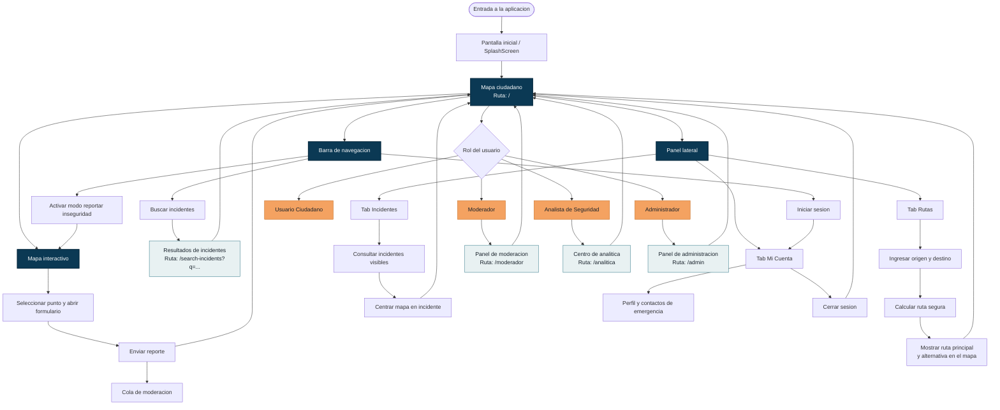

# Mapa de Navegacion

## Plataforma "Rutas Inseguras"

Este diagrama representa la navegacion implementada actualmente en el frontend React. Las rutas indicadas corresponden a `frontend/src/App.jsx` y los accesos visibles por rol a `frontend/src/components/Navbar.jsx`.

## Rutas de la aplicacion

| Ruta | Vista | Acceso desde la interfaz |
| --- | --- | --- |
| `/` | Mapa ciudadano, rutas seguras, incidentes, cuenta y reportes | Todos los usuarios |
| `/search-incidents?q=...` | Resultados de busqueda de incidentes | Buscador de la barra superior |
| `/moderador` | Moderacion de reportes | Moderador y Administrador |
| `/analitica` | Analisis e indicadores de seguridad | Analista de Seguridad y Administrador |
| `/admin` | Gestion de usuarios y roles | Administrador |

## Navegacion interna del mapa

- **Rutas:** calcula y visualiza una ruta segura y su alternativa.
- **Incidentes:** consulta los reportes y permite centrar el mapa en un punto.
- **Mi Cuenta:** permite iniciar sesion, consultar el perfil y gestionar contactos de emergencia.
- **Reportar inseguridad:** activa el modo de seleccion de un punto del mapa y abre el formulario de reporte.

> Nota: los accesos por rol se ocultan en la barra de navegacion cuando el rol no corresponde. La proteccion de rutas frente a acceso directo debe validarse tambien en el backend mediante autenticacion y autorizacion.
